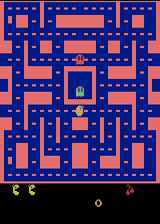

# Deep Convolutional Q-Learning for Pac-Man

This project implements a Deep Convolutional Q-Learning (DCQN) agent to play the classic arcade game Ms. Pac-Man. The agent learns to make decisions based on the game's screen pixels, using a convolutional neural network to process the visual input and a Q-learning algorithm to optimize its actions.

## Requirements

- Python 3.6+
- PyTorch
- Gymnasium
- NumPy
- Pillow (PIL)
- Torchvision

## Results

The trained DCQN agent is able to achieve a high score in Ms. Pac-Man, demonstrating its ability to learn effective strategies for navigating the game environment and collecting points. The agent's performance can be further improved by adjusting the hyperparameters and training for a longer duration.

## Acknowledgements

This project is inspired by various resources on Deep Q-Learning and Atari game playing agents.

## License

This project is licensed under the MIT License.
